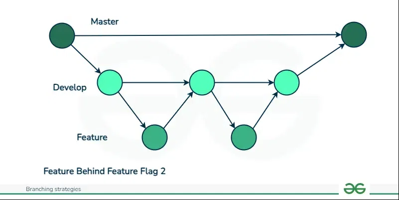

Vi har valgt at bruge en feature branching strategi, hvor vi har:
* 'main' branch der bruges til produktionskode
* 'dev' branch der bruges til udvikling og test af kode
* 'feature' branches, hvor vi bygger features, og integrerer dem ind i dev.

Denne strategi mindsker risikoen for konflikter, og er god hvis man arbejder flere på samme projekt. det kan også nemt skaleres op hvis der kommer flere udviklere på projektet.

Det er også smart at skilne mellem produktionskode, og kode der stadig er under udvikling.

Dog kan det være komplekst at arbejde i hvis man ikke er vant til det, og kan skabe mergekonflikter hvis en featurebranch har været under udvikling i længere tid.

## Refleksioner over vores branching strategi (del af Mandatory 2)
Vores valg om, at implementere en feature branching strategi, har både givet os fordele og udfordringer. I dette afsnit vil vi reflektere over vores erfaringer og overveje, hvordan strategien har påvirket vores udviklings proces. 

### Fordele
*Isolation af udviklingsarbejde*
En af de største fordele ved vores strategi har værest muligheden for at isolere vores arbejde på nye funktioner i seperate branches. Dette har gjort det muligt for os at udvikle og teste nye funktioner uden at risikere at påvirke produktionskoden i vores main branch eller den fælles udviklingskode i vores dev branch.

*Fleksibilitet og samarbejde*
Vores branching strategi har også gjort det muligt for os at arbejde fleksibelt og samtidig samarbejde effektivt. Flere gruppemedlemmer har kunnet arbejde parallellt på forskellige funktioner uden at komme i vejen for hinanden. Det har hjulpet til at øge vores produktivitet og gjort det nemmere at håndtere mere komplekse opgaver.

*Kvalitetssikring*
Inden merge af nye funktioner til dev eller main branch, har vi gennemført code review. Desuden har vi implementeret forskellige værktøjer, som hjælper os med at kvalitetssikre koden inden den kan merges. 

### Udfordringer
*Merge konflikter*
En af de største udfordringer, som kan opstå ud fra vores branching strategi er marge konflikter. Disse kan opstå specielt, når en feature har været under udvikling i længere tid. At løse de konflikter, som kan opstå, kan være komplekse og tidskrævende. Dog er det vores erfaring, at der gennem projektet har været et fåtal at merge konflikter. Dette kan skyldes, at vi allerede fra start af havde lagt en klar branching strategi og regler. Hvilket gjorde det nemmere for gruppemedlemmerne at følge og implementere i hvert deres arbejde.

### Hvad tager vi med os? 
*Hyppig integration*
En vigtig læring vi tager med, er at få at holde antalle af merge konflikter nede, er det vigtigt hyppigt at integrere branches. Hyppigheden og klarheden om selve strategien, har fra projektets begyndelse hjulpet os med at holde vores branches synkroniserede og reduceret antallet af merge konflikter. 

*Dokumentation og kommunikation*
Vi har indset, at dokumentation, klarhed og åben kommunikation er nødvendigt for at sikre, at alle gruppemedlemmer forstår og følger branching strategien. Det er netop disse elementer, som har været med til ikke kun at forbedre processen, men også gjort samarbejdet mere effektivt.

*Kontinuerlig forbedring*
Refleksion over forskellige dele af projektet og valgfaget, har vist sig værdifulde for os, da det har kunnet klargøre områder, hvor vi kan forbedre os. Derfor vil vi fortsætte med at evaluere og forbedre vores branching strategi. Desuden har vi også fundet en motivation eller mod, for at afprøve nye tilgange, lære af vores fejl - og på den måde kontinueligt forbedre vores udviklingsproces. 